## My Responses to Your Comments

**On annotation via Chrome:** Agreed. The browser's Canvas2D API is genuinely powerful — arbitrary polygons, text labels, compositing, all with zero Python dependencies. The round-trip cost is acceptable for the rendering capability gained. I retract the recommendation to move annotation to Python. The browser is not just a viewer — it's a rendering co-processor, and that's a valid architecture.

**On SSE single endpoint with event types:** You're right. Multiple SSE endpoints would multiply connection management, thread overhead, and reconnection logic. The current design uses SSE event types (`annotate`, `agent_state`, `message`) as the discriminator — this is exactly what SSE was designed for. One connection, typed events, extensible for future addons. I retract the recommendation to split SSE endpoints.

**On annotated image not sent to VLM:** Yes, this is true. Looking at `brain_chess_players.py`:

1. Agent `tactics` calls `bu.annotate(name, image_b64, grid_overlays)` → gets annotated image back
2. That annotated image is sent to VLM via `bu.make_vlm_request_with_image(system_prompt, annotated_b64, user_text)`
3. But later, `tactics` calls `bu.annotate(name, annotated_b64, arrow)` to draw the arrow — this second annotated result (`arrow_b64`) is **never sent to VLM**. It was only used for `ui_vlm_cycle` display (now dead).
4. There is **no direct agent-to-agent communication that involves images without VLM**. All inter-agent communication goes through panel.py SSE async push, and currently only `arbiter` uses it to send `next_round` events to itself (containing `board_b64` — a raw capture, not annotated).

So: agents annotate images primarily for VLM consumption. The second annotation (arrow drawing) was purely cosmetic for the old UI. With the new interception design, those arrow annotations still happen (the brain still calls `bu.annotate`), the browser still renders them, the result returns to the brain — but the brain doesn't do anything with it since the `ui_vlm_cycle` calls are commented out. This is indeed dead work now.

---

Here is the comprehensive README.md:

````markdown
# FranzAi-Plumbing

A multi-agent visual AI system where autonomous brain agents capture screen regions, annotate images with overlays, send them to a Vision-Language Model (VLM) for analysis, and execute actions on Windows based on VLM decisions. The panel server orchestrates all communication while automatically intercepting data flows to provide a real-time debugging UI with zero brain-side UI code.

## Architecture Overview

The system follows a **hub-and-spoke** architecture where `panel.py` is the central router. Every brain agent communicates exclusively through panel. The browser serves dual roles: passive UI viewer and active annotation renderer (Canvas2D co-processor).

### Components

| Component | File | Role | Process Model |
|---|---|---|---|
| Panel Server | `panel.py` | Central HTTP router, SSE hub, VLM proxy, UI state interceptor | Main process |
| Panel UI | `panel.html` | Dynamic agent viewer, Canvas2D annotation renderer | Chrome tab |
| Brain SDK | `brain_util.py` | Client library for brain agents (HTTP helpers, overlay builders) | Imported by brains |
| Chess Brain | `brain_chess_players.py` | Multi-agent chess analysis brain | Child process of panel |
| Win32 Engine | `win32.py` | Screen capture, mouse/keyboard automation, region selection | Spawned subprocess per call |
| LM Studio | External | VLM inference server (OpenAI-compatible API) | External on port 1235 |

### Communication Channels

```mermaid
%%{init: {'theme': 'dark', 'themeVariables': {'primaryColor': '#1a1a2e', 'primaryTextColor': '#e0e0ea', 'primaryBorderColor': '#4a9eff', 'lineColor': '#4a9eff', 'secondaryColor': '#16213e', 'tertiaryColor': '#0f3460', 'edgeLabelBackground': '#1a1a2e', 'clusterBkg': '#131318', 'clusterBorder': '#252530', 'titleColor': '#e0e0ea', 'nodeTextColor': '#e0e0ea'}}}%%
graph TB
    subgraph BRAIN["Brain Process (brain_chess_players.py)"]
        BA["Agent: tactics"]
        BB["Agent: positional"]
        BC["Agent: attacker"]
        BD["Agent: defender"]
        BE["Agent: arbiter"]
        SDK["brain_util.py SDK"]
        BA --> SDK
        BB --> SDK
        BC --> SDK
        BD --> SDK
        BE --> SDK
    end

    subgraph PANEL["Panel Server (panel.py) :1236"]
        ROUTE["/route endpoint"]
        RESULT["/result endpoint"]
        SSE_HUB["SSE Hub /agent-events"]
        STATE["_agent_ui_state dict"]
        CAPTURE_H["_handle_win32_capture"]
        ANNOTATE_H["_handle_annotate"]
        VLM_H["_handle_vlm"]
        DEVICE_H["_handle_win32_device"]
        ASYNC_H["_handle_async_push"]

        ROUTE --> CAPTURE_H
        ROUTE --> ANNOTATE_H
        ROUTE --> VLM_H
        ROUTE --> DEVICE_H
        ROUTE --> ASYNC_H

        CAPTURE_H -->|"stores raw_image_b64"| STATE
        VLM_H -->|"stores system_prompt, user_message, vlm_image_b64, vlm_reply"| STATE
        STATE -->|"agent_state event"| SSE_HUB
        ANNOTATE_H -->|"annotate event"| SSE_HUB
        ASYNC_H -->|"message event"| SSE_HUB
    end

    subgraph BROWSER["Chrome Browser (panel.html)"]
        ES["EventSource SSE client"]
        CANVAS["OffscreenCanvas renderer"]
        UI["Dynamic agent paper blocks"]
        NOTIF["Notification bar"]

        ES -->|"agent_state"| UI
        ES -->|"annotate"| CANVAS
        ES -->|"message status/error"| NOTIF
        CANVAS -->|"POST /result"| RESULT
    end

    subgraph WIN32["win32.py subprocess"]
        CAP["capture command"]
        INPUT["click/drag/type/scroll"]
        SELECT["select_region"]
    end

    subgraph LMS["LM Studio :1235"]
        VLMAPI["/v1/chat/completions"]
    end

    SDK -->|"HTTP POST /route"| ROUTE
    SSE_HUB -->|"SSE stream agent=ui"| ES
    SSE_HUB -->|"SSE stream agent=arbiter"| SDK
    CAPTURE_H -->|"subprocess"| CAP
    DEVICE_H -->|"subprocess"| INPUT
    VLM_H -->|"HTTP POST"| VLMAPI
    VLMAPI -->|"JSON response"| VLM_H
    CAP -->|"PNG bytes stdout"| CAPTURE_H
    RESULT -->|"unblocks threading.Event"| ANNOTATE_H

    style BRAIN fill:#1a1a2e,stroke:#c084fc,stroke-width:2px
    style PANEL fill:#131318,stroke:#4a9eff,stroke-width:2px
    style BROWSER fill:#16213e,stroke:#3ecf8e,stroke-width:2px
    style WIN32 fill:#0f3460,stroke:#f0a000,stroke-width:2px
    style LMS fill:#1a1a2e,stroke:#ff4455,stroke-width:2px
```



## Communication Protocol

### Single Entry Point: POST /route

All brain-to-panel communication goes through `POST /route` with a JSON body containing:

```json
{
  "agent": "agent_name",
  "recipients": ["recipient1", "recipient2"],
  ...payload fields
}
```

**Sync recipients** (panel blocks and returns result):

| Recipient | Payload | Returns |
|---|---|---|
| `win32_capture` | `region`, `capture_scale` or `capture_size` | `{image_b64}` |
| `annotate` | `image_b64`, `overlays[]` | `{image_b64}` (annotated) |
| `vlm` | `vlm_request` (OpenAI-format) | Full VLM response JSON |
| `win32_device` | `region`, `actions[]` | `{ok: true}` |

**Async recipients** (panel pushes via SSE, returns immediately):

| Recipient | Behavior |
|---|---|
| `ui` | Pushes to browser SSE channel |
| Any brain name | Pushes to that brain's SSE channel, auto-launches brain if not running |

**Rule:** At most one sync recipient per request. Multiple async recipients allowed alongside one sync.

### SSE Event Types on agent=ui Channel

| Event | Source | Purpose |
|---|---|---|
| `connected` | SSE infrastructure | Connection established signal |
| `agent_state` | Panel interception | Updates the 5-section paper block for an agent |
| `annotate` | `_handle_annotate` | Requests browser to render overlays, expects `/result` POST back |
| `message` | Brain via `push()` | Status notifications, errors, generic messages |

### Annotation Round-Trip Protocol

1. Brain calls `annotate(agent, image_b64, overlays)` via `POST /route`
2. Panel creates a `threading.Event`, stores it with a `request_id`
3. Panel pushes SSE `annotate` event to browser with `{request_id, agent, image_b64, overlays}`
4. Browser draws overlays on `OffscreenCanvas`, converts to PNG base64
5. Browser `POST /result` with `{request_id, image_b64}`
6. Panel matches `request_id`, sets the `threading.Event`, returns annotated image to brain

Timeout: 19 seconds. If browser is not connected, annotate silently fails.

### Automatic UI Interception (New Design)

Panel.py intercepts three operations and automatically maintains per-agent UI state:

**Interception 1: win32_capture**
- Stores captured `image_b64` as `raw_image_b64` → Section 1 (RAW) in UI

**Interception 2: vlm request (before forwarding)**
- Extracts `system_prompt` from `messages[0]` → Section 3
- Extracts `user_message` text from `messages[1]` → Section 4
- Extracts image from `messages[1]` `image_url` content → Section 2 (VLM IMAGE)
- If no image in request → Section 2 shows 1x1 black pixel (debugging indicator)

**Interception 3: vlm response (after receiving)**
- Extracts `choices[0].message.content` → Section 5 (VLM REPLY)

Each interception triggers an `agent_state` SSE push to the browser. The brain developer writes zero UI code.

### UI Paper Block Layout

Each agent gets one vertical paper block with 5 sections:

```
+---------------------------+
| AGENT NAME          TS    |
+-------------+-------------+
| 1 RAW       | 2 VLM IMG   |  ← Images side-by-side, draggable split
+---------------------------+  ← Draggable horizontal edge
| 3 SYS PROMPT              |
+---------------------------+  ← Draggable horizontal edge
| 4 USR MESSAGE              |
+---------------------------+  ← Draggable horizontal edge
| 5 VLM REPLY                |
+---------------------------+
```

- First block created is the **master** — drag handles control CSS custom properties
- All subsequent blocks mirror master proportions via shared CSS variables
- Images use `object-fit: contain` (preserve aspect ratio, may leave empty space)
- Text sections auto-scroll to bottom on new content
- Resizing affects view only, never touches pipeline data

### Overlay Format

Overlays are polygon definitions used for annotation rendering:

```json
{
  "type": "overlay",
  "points": [[x1, y1], [x2, y2], ...],
  "closed": false,
  "stroke": "#00ff00",
  "stroke_width": 2,
  "fill": "rgba(0,255,0,0.3)",
  "label": "text label"
}
```

All coordinates are in **normalized 0-1000 space** (NORM=1000). The browser Canvas2D renderer scales them to actual image pixel dimensions.

### VLM Request Format

OpenAI-compatible `/chat/completions` format:

```json
{
  "model": "qwen3.5-0.8b",
  "temperature": 0.7,
  "max_tokens": 300,
  "messages": [
    {"role": "system", "content": "system prompt text"},
    {"role": "user", "content": [
      {"type": "image_url", "image_url": {"url": "data:image/png;base64,..."}},
      {"type": "text", "text": "user instruction"}
    ]}
  ]
}
```

For text-only requests, user content is a plain string instead of the array format.

### Win32 Coordinate System

All screen coordinates use **normalized 0-1000 space** relative to a selected region. The region itself is defined as `x1,y1,x2,y2` in screen-relative normalized coordinates. win32.py converts normalized coordinates to actual screen pixels using the region bounds.

## Changes from Original Codebase

### What Changed

| Area | Before | After |
|---|---|---|
| UI updates | Brain manually called `ui_vlm_cycle()` with all 5 data fields | Panel automatically intercepts capture/vlm operations |
| UI data source | Brain pushed assembled data | Panel extracts from live request/response payloads |
| Section 2 image | Annotated image from brain | Image extracted from VLM request payload (what VLM actually sees) |
| Block creation | Required brain to push `vlm_cycle` event | Dynamic: first `agent_state` event auto-creates block |
| Block layout | Fixed grid of agent blocks | Horizontal scroll of paper blocks, draggable section edges |
| `ui_vlm_cycle` | Active function pushing SSE events | No-op `pass` (dead code, kept for transition) |

### What Stayed Identical

| Component | Status |
|---|---|
| `win32.py` | Completely untouched |
| `/route` multiplexer logic | Unchanged |
| SSE infrastructure | Unchanged (new event type `agent_state` added) |
| Annotation round-trip protocol | Unchanged |
| Brain SDK functions | Unchanged (capture, annotate, vlm, device, push) |
| VLM proxy forwarding | Unchanged (interception added around it) |

### Dead Code Identified

| Item | Location | Status |
|---|---|---|
| `ui_vlm_cycle()` | `brain_util.py` | Body replaced with `pass`, callers commented out |
| `vlm_cycle` event handler | `panel.html` (old) | Removed in new HTML |
| Second annotation in `_player_cycle` (arrow drawing) | `brain_chess_players.py` | Still executes but result unused since `ui_vlm_cycle` commented out |

## File Dependency Map

```
panel.py (standalone - imports only stdlib)
  ├── serves panel.html
  ├── spawns win32.py as subprocess
  ├── spawns brain_*.py as child processes
  └── forwards to LM Studio HTTP API

brain_chess_players.py
  └── imports brain_util.py

brain_util.py (standalone - imports only stdlib)
  └── HTTP client to panel.py

win32.py (standalone - imports only stdlib + ctypes)
  └── CLI tool, no imports from project

panel.html (standalone)
  └── SSE client + HTTP client to panel.py
```

Every component is independently deployable. No circular dependencies.

## Running

```
python panel.py brain_chess_players.py
```

1. Presents region selector overlay (win32.py)
2. Presents scale reference selector
3. Starts HTTP server on :1236
4. Launches brain as child process
5. Open `http://127.0.0.1:1236` in Chrome

## Configuration Constants

All configuration lives in frozen dataclasses:

| Dataclass | File | Purpose |
|---|---|---|
| `_Config` | `panel.py` | Server ports, timeouts, log file |
| `Win32Config` | `win32.py` | Drag speed, click delays, DPI |
| `VLMConfig` | `brain_util.py` | Model name, temperature, tokens |
| `SSEConfig` | `brain_util.py` | Reconnect delay, timeout |
| `BrainArgs` | `brain_util.py` | Region, scale (CLI parsed) |
| `ChessConfig` | `brain_chess_players.py` | Grid size, colors, semaphore counts |

---

## Claude Opus 4 System Prompt for Future Code Review Sessions

```
You are a senior reviewer and co-developer of FranzAi-Plumbing, a multi-agent
visual AI system for Windows 11. You have deep knowledge of this specific
codebase and its non-standard architecture. Read all provided files completely
before responding.

PROJECT ARCHITECTURE:
- panel.py: Central HTTP server (:1236) that routes ALL communication between
  components. Single POST /route endpoint multiplexes to: win32_capture
  (subprocess), annotate (browser round-trip via SSE), vlm (HTTP proxy to LM
  Studio :1235), win32_device (subprocess), and async push (SSE to other
  agents). Panel automatically intercepts capture and vlm operations to maintain
  per-agent UI state without brain cooperation.
- panel.html: Chrome-only viewer AND Canvas2D annotation co-processor.
  Connected via SSE (agent=ui). Receives agent_state events for display and
  annotate events for rendering overlays on OffscreenCanvas. Returns annotated
  images via POST /result. Dynamic paper blocks created per agent. First block
  is master for drag-resize propagation.
- brain_util.py: Stateless SDK library imported by brain agents. Provides
  capture(), annotate(), vlm(), vlm_text(), device(), push() - all HTTP
  clients to panel.py /route. Also provides overlay builders and VLM request
  constructors.
- brain_chess_players.py: Example brain with 5 agents (tactics, positional,
  attacker, defender, arbiter) running in threads within one process.
  Communicates exclusively through brain_util.py to panel.py.
- win32.py: Standalone CLI tool for screen capture (raw BGRA to PNG), mouse,
  keyboard, drag, scroll, and region selection overlay. Uses only ctypes
  Win32 API. Spawned as subprocess by panel.py.
- LM Studio: External VLM server running OpenAI-compatible API on :1235.

KEY PROTOCOLS:
- All coordinates use normalized 0-1000 space (NORM=1000)
- SENTINEL value "NONE" used across all components for absent/empty data
- Annotation: brain calls annotate() -> panel SSE pushes to browser -> browser
  renders polygons on OffscreenCanvas -> POST /result -> panel unblocks caller
- VLM interception: panel extracts system_prompt, user_message, and image from
  VLM request messages array; extracts reply from response choices array
- SSE single endpoint /agent-events?agent=<name> with typed events (connected,
  agent_state, annotate, message)
- VLM requests follow OpenAI /chat/completions format with image_url content
  type for vision

CODING RULES (enforce strictly):
- Python 3.13, Windows 11, latest Chrome only. No legacy, no cross-platform.
- Strict typing, frozen dataclasses for config, pattern matching.
- No comments in code files. No non-ASCII in code blocks.
- No data slicing/truncating anywhere. No magic values outside dataclasses.
- No duplicate flows. No hidden fallbacks unless approved.
- HTML: dark cyber aesthetic, independent dark theme, 1080p 16:9 target.
- VLM prompts as triple-quoted docstrings, not concatenated strings.
- Maximum code reduction while preserving 100% functionality.

WHEN ANALYZING LOG FILES (panel.txt):
- Format: ISO_TIMESTAMP | event_name | key=value pairs
- Images appear as <IMG_b64:SHA256_PREFIX> (sanitized by log formatter)
- Key events: route, capture_done, annotate_sent, annotate_received,
  vlm_forward, vlm_response, vlm_error, brain_launched, sse_connect,
  sse_disconnect, action_dispatch
- Look for: timeout patterns, error sequences, missing agent_state pushes,
  capture failures, VLM error rates, SSE disconnection frequency

WHEN RECEIVING FILES:
- Read ALL provided files completely before any analysis
- If receiving base64-encoded HTML, decode it first
- Each component is independent - you may receive only one file for review
- Cross-reference against the architecture above even if other files not provided
- Identify: dead code, duplicated logic, broken interception paths, type errors,
  missing error handling, deviation from coding rules

WHEN PROPOSING CHANGES:
- Output complete files, never partial patches
- Two files at a time maximum per response
- Explain what changed and why after the code
- Flag if a change requires updates to other components not provided
- Preserve all existing functionality unless explicitly asked to remove

CURRENT KNOWN ISSUES TO TRACK:
- ui_vlm_cycle() in brain_util.py is a no-op pass (dead code, kept for transition)
- All ui_vlm_cycle calls in brain_chess_players.py are commented out
- Second annotation call in _player_cycle (arrow drawing) executes but result
  is unused since ui_vlm_cycle is dead
- Brain self-messaging (arbiter -> arbiter via panel) could be local queue
- ui_status/ui_error still do full HTTP round-trip for simple notifications
```

---

*Generated from analysis of the complete FranzAi-Plumbing codebase. Last updated after communication architecture redesign session.*
````